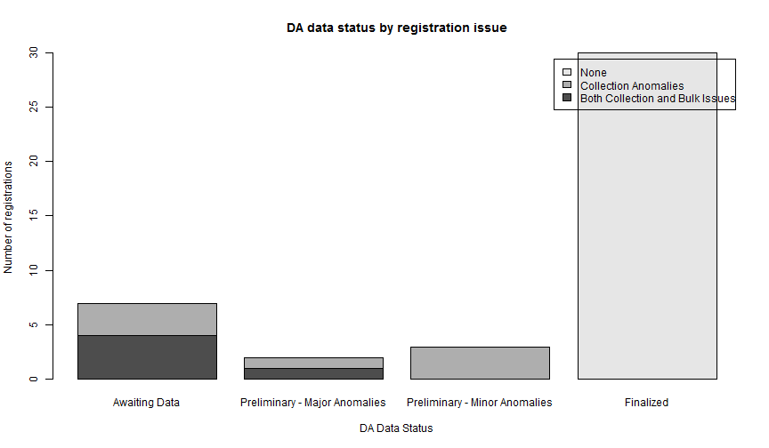
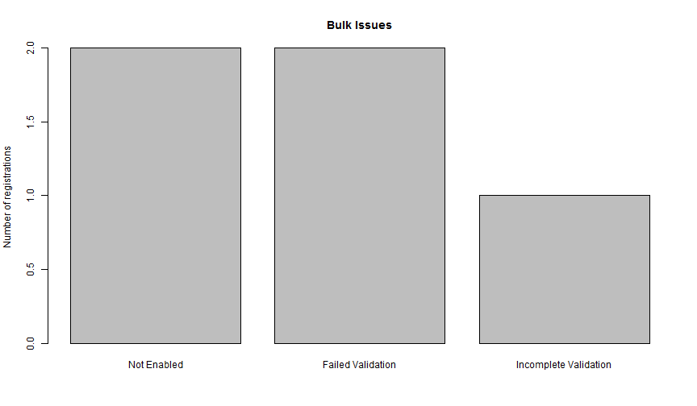
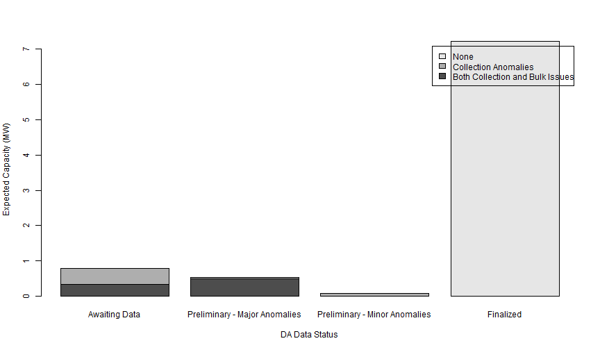

# QDQE Report Visualizer Tool 

Team,
In the recent dispatch, 15.3% of our portfolio's MW (9 of 42 assets) were unusable for initial performance calculations. 55.56% of these issues (5/9 assets) resulted from incomplete enablement, incorrect platform configuration, or unfinished DMT meter validations. The majority of the remaining assets had no data available in the platform for the M&V period.<link href="custom.css" rel="stylesheet"> 
 
## The following table describes the sources of reduced visibility:

<!-- html table generated in R 3.0.1 by xtable 1.7-3 package -->
<!-- Fri Aug 08 09:03:55 2014 -->
<TABLE border=1>
<TR> <TH> Category </TH> <TH> Number.Not.Reporting </TH> <TH> Percent.Not.Reporting </TH> <TH> Description </TH> <TH> Issue.Owner </TH>  </TR>
  <TR> <TD> No Data </TD> <TD align="right">   4 </TD> <TD> 44% </TD> <TD> Data is missing for most or all of M&amp;V period </TD> <TD> Ops </TD> </TR>
  <TR> <TD> Failed/Incomplete Validation </TD> <TD align="right">   3 </TD> <TD> 33% </TD> <TD> Open 2012/2013 validation case </TD> <TD> DMT </TD> </TR>
  <TR> <TD> Enablement/Configuration Issue </TD> <TD align="right">   2 </TD> <TD> 22% </TD> <TD> EnerNOC platform is not capturing entire utility service account </TD> <TD> Ops </TD> </TR>
  <TR> <TD> Total </TD> <TD align="right">   9 </TD> <TD> 100% </TD> <TD>  </TD> <TD>  </TD> </TR>
   </TABLE>
*Further details into impacted assets are available from the Data Quality team

## Graphs
   
